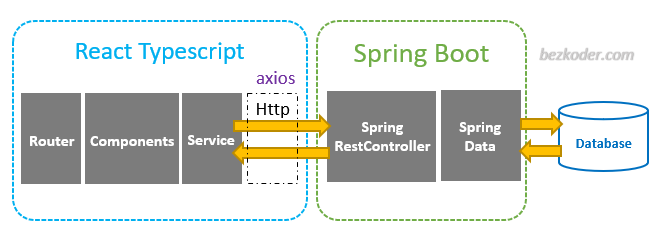

# NPC Project

## Get Starter (how to run the project)

> run this project inside the configured container by `.devcontainer`. See [how to open this run this in your machine](https://code.visualstudio.com/docs/devcontainers/create-dev-container#_create-a-devcontainerjson-file) 

or 

> run this project using Github CodeSpace, clicking here:

## Application Architecture 

> Spring Boot exports REST Apis using Spring Web MVC & interactsrations & finder methods with Spring D.

> React Client sends HTTP Requests and retrieves HTTP Responses using Axios. React Router is used for navigating to pages.

## Spring Boot Rest Apis Back-end
### Overview

These are APIs that Spring Boot App will export:

| Methods |      Urls      | Actions                |
|:--------|:---------------|:-----------------------|
| POST    | /api/users     | create a new User      |
| GET     | /api/users     | retrieve all users     |
| GET     | /api/users/:id | retrieve a user by :id |

## Technology

- Java 17 / 11 / 8
- Maven 3.9.4
- Spring Boot 3 (with Spring Web MVC, Spring Data JPA)
- NodeJS v20.6.1
- Npm 9.8.1
- React 18, Typescript 5, Vite 4
- Postgres 16
